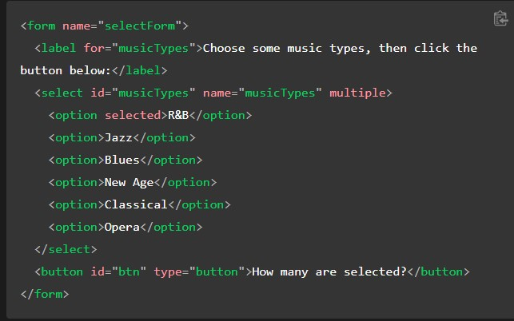
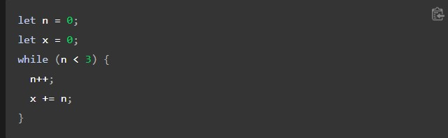

# Operators and loops

## Types of operators

- Assignment operators
- Comparison operators
- Arithmetic operators
- Bitwise operators
- Logical operators
- BigInt operators
- String operators
- Conditional (ternary) operator
- Comma operator
- Unary operators
- Relational operators

## Assignment operators

| Name	                         | Shorthand  |	Meaning
|:------------------------------:|:-----------:|:------------------:|
| Assignment                     | `x = f()`   |`	x = f()  `      |
| Addition assignment            |`	x += f()`  |`	x = x + f() `   |
| Subtraction assignment         |`	x -= f() ` |`	x = x - f()`    |
| Multiplication assignment      |`	x *= f()  `|`	x = x * f() `   |
| Division assignment            |`	x /= f() ` |`	x = x / f() `   |
| Remainder assignment           |`	x %= f() ` |`	x = x % f() `   |
| Exponentiation assignment      |`	x **= f()` |`	x = x ** f()`   |
| Left shift assignment          |`	x <<= f()` |`	x = x << f() `  |
| Right shift assignment         |`	x >>= f()` |`	x = x >> f()`   |
| Unsigned right shift assignment|`	x >>>= f()`|`	x = x >>> f()`  |
| Bitwise AND assignment         |`	x &= f()  `|`	x = x & f()`    |
| Bitwise XOR assignment         |`	x ^= f()  `|`	x = x ^ f() `   |
| Bitwise OR assignment          |`	x = f()   `|`	x = x | f()`    |
| Logical AND assignment         |`	x &&= f() `|`	x && (x = f())` |
| Logical OR assignment          |`	x ||= f() `|`	x || (x = f()) `|
| Logical nullish assignment     |`	x ??= f() `|`	x ?? (x = f())` |

## loops

>Loops offer a quick and easy way to do something repeatedly. This chapter of the JavaScript Guide introduces the different iteration statements available to JavaScript.

>You can think of a loop as a computerized version of the game where you tell someone to take X steps in one direction, then Y steps in another. For example, the idea "Go five steps to the east" could be expressed this way as a loop:

There are many different kinds of loops, but they all essentially do the same thing: they repeat an action some number of times. (Note that it's possible that number could be zero!)

The various loop mechanisms offer different ways to determine the start and end points of the loop. There are various situations that are more easily served by one type of loop over the others.

The statements for loops provided in JavaScript are:

- for statement
- do...while statement
- while statement
- labeled statement
- break statement
- continue statement
- for...in statement
- for...of statement

## for statement

> A for loop repeats until a specified condition evaluates to false. The JavaScript for loop is similar to the Java and C for loop.
---
> When a for loop executes, the following occurs:

1. The initializing expression initialExpression, if any, is executed. This expression usually initializes one or more loop counters, but the syntax allows an expression of any degree of complexity. This expression can also declare variables.
2. The conditionExpression expression is evaluated. If the value of conditionExpression is true, the loop statements execute. Otherwise, the for loop terminates. (If the conditionExpression expression is omitted entirely, the condition is assumed to be true.)
3. The statement executes. To execute multiple statements, use a block statement ({ }) to group those statements.
4. If present, the update expression incrementExpression is executed.
5. Control returns to Step 2.

---
## while statement

A while statement executes its statements as long as a specified condition evaluates to true. A while statement looks as follows:

> If the condition becomes false, statement within the loop stops executing and control passes to the statement following the loop.
---
> The condition test occurs before statement in the loop is executed. If the condition returns > true, statement is executed and the condition is tested again. If the condition returns false, execution stops, and control is passed to the statement following while.

To execute multiple statements, use a block statement ({ }) to group those statements.

| [Back to Home](../README.md)