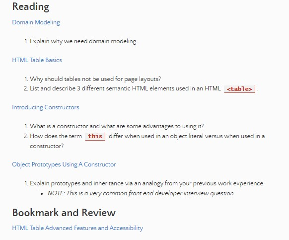

# Read 07

## Why do we need domain modeling

domain modeling is a way of implementing trackable data into readable tables inside a website. you can develop functions and processes that will actualize different data that can be used between both business and technical teams

## why should tables not be used for page layouts

it was ca commonly used practice in the past because css support across browsers used to be terrible but its a bad idea

- layout tables reduce accessability for visually impaired users

- tables produce tag soup(it makes the table more hard to read and track)

- tables are not automatically responsive. when you used tags elements are sized accorfing to the page where as when you use tables they are relative tot he tables rules

## 3 different semantic HTML elements

- td tag it stands for table data 
- th tags will be used at the tops of tables to devide the header from the elements within the table
-colspan willl span the stuff across two columns'
-rowspan will span aacross two rows

