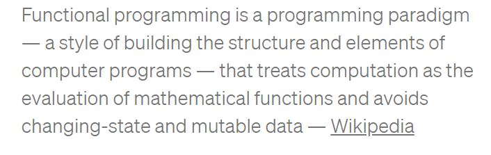

# Functional Programming

## What is functional programming?

## What is a pure function and how do we know if something is a pure function?
If it returns the same result if it is given the same argument

## What are the benefits of a pure function?
The code’s definitely easier to test. We don’t need to mock anything. So we can unit test pure functions with different contexts

## What is immutability?
when a state is unchangeable after it is created

## What is Referential transparency?
if a function consistently yields the same result for the same input, it is referentially transparent.
---
## What is a module?
its a seperation of functionality into smaller sections

## What does the word ‘require’ do?
creates a path to another module

## How do we bring another module into the file the we are working in?
module.exports = ();

## What do we have to do to make a module available?
set a variable equal to what is required(sent into the new module)

[Node js beginner tutorial](https://www.youtube.com/watch?v=xHLd36QoS4k)
[functional programming](https://medium.com/the-renaissance-developer/concepts-of-functional-programming-in-javascript-6bc84220d2aa)
