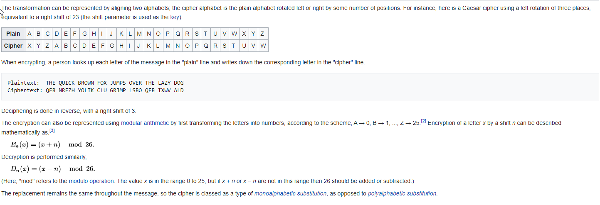

# Cryptography

cryptography is the way that we can ecrypt things on the web, things are encrypted and decripted of sent into a cypher so that security can sperate your data from the any unwanted endpoint.

## Encryotion, Decryption and hacking

ceaser cyper was one of the earliest ciphers created it is a simple substitution cipher that replaces each original letter with a differenrt letter in the alphabet by shifting the alphabet by a certain amount 

decrypting a cipher is as simple as knowing the key and returning the message back to its original format using the key in ceasers case it was to reverse the letters back 3 letters in the alphabet

the three main techniques for cracking a cypher 
- Frequency analysis
- plaintext
- brute force

**Frequency analysis** 

this uses the knowledge that some letters are used more often in the human language and you can narrow down the possible amount of shits down in that manner with predicting what character you may think is E you can use that letters guide a cracking of the cypher

**Plaintext**

plain text is built on the idea that the person trying to crack the cipher alreasy knows some of the original message un encrypted or in "PLaintext" it will be easier for them to find the other characters in the message and from that build a key

**Brute Force**

Brute force is taking every letter and shuffling it through the alphabet until you get a match one word at a time or even a couple until they are a legible message

## Ceaser Cipher

just like in the last artical a ceaser cipher is about shifting each individual character to a key of an integer if A was shifted by 4 it would be the letter E

deciphering would be done in the reverse by basically unshifting the characters 

the ceaser cypher is named aftere julias ceaser 

you can break this cypher with any of the forementioned methods, its not hard with a simple shift method to crack this because it can only be shifted the the integer of 25 as the english language is limited to 26 letters with a max shift of 25

## Crash Course computer science

Discussed the history of encryption, good entertainment but it wasnt that interesting and seemed as if it was 12 minutes of busy work

you connect to a public key cryptography, we exchange a key with the data that we are trying to keep out of the hands of others, we establish a connection with the security protocal and using the current industry standard it would supposedly take a trillion years to crack the encryption algorithm, interesting

## things i want to know more about

why is it import to learn a completley new tool every single day, i feel like i understand the name of the last tool every day and then the next day we learn something completley new and unrealated, i have an incredibly large tool belt with the dullest tools 

## Resources

[Encryption, Decryption & Hacking](https://www.khanacademy.org/computing/computers-and-internet/xcae6f4a7ff015e7d:online-data-security/xcae6f4a7ff015e7d:data-encryption-techniques/a/encryption-decryption-and-code-cracking)

[Ceasar Cipher](https://en.wikipedia.org/wiki/Caesar_cipher)

[Cryptography Crash Course](https://www.youtube.com/watch?v=jhXCTbFnK8o)

[Introduction to Cryptography](https://thebestvpn.com/cryptography/)

[How Computers Generate Random Numbers](https://www.howtogeek.com/183051/htg-explains-how-computers-generate-random-numbers/)
