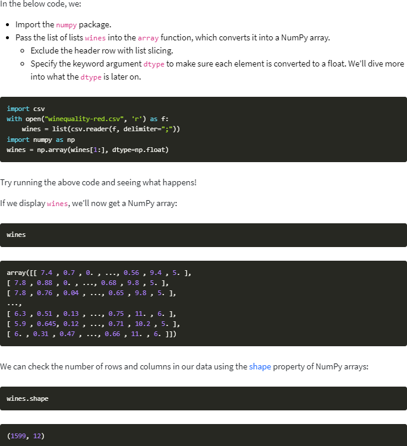

# Data Analysis
This pertains to what we are doing today because as we enter further into python its best uses are in the data science sector of tech and manipulating data is where this programming can be very powerful
## What is jupyter Lab

jupyter lab is a library and also an extension in some ide's it can be run in your browser, its similar to replic but its helpful because you can split code into more palateable sections so that i will not break when running because small problems can be contained 

> JupyterLab enables you to work with documents and activities such as Jupyter notebooks, text editors, terminals, and custom components in a flexible, integrated, and extensible manner

Code consoles can be run next to virtually any kernal banked documents the code can run on its own and interpret the documents 

## Numpy Tutorial

this is one of the main tools to analyze and manipulate data in python, virtually all data analysis package and machine learning package leverages pythons numpy in some way.

- (semicolon separated values) format — each record is separated by a semicolon (;), and rows are separated by a new line.

With NumPy, we work with multidimensional arrays. 2-dimensional arrays. A 2-dimensional array is also known as a matrix,a list of lists. A matrix has rows and columns. By specifying a row number and a column number, we’re able to extract an element from a matrix. using numpy 

 create a NumPy array using the numpy.array function. If we pass in a list of lists, it will automatically create a NumPy array with the same number of rows and columns. Because we want all of the elements in the array to be float elements for easy computation, One of the limitations of NumPy is that all the elements in an array have to be of the same type, so if we include the header row  and that row is a string , all the elements in the array will be read in as strings. Because we want to be able to do computations like find the average quality of the wines, we need the elements to all be floats.

## video
jupyter provides full support for system shells, its able to take in almost all popular image formats, its very optomzed well and can interpret a lot of different languages and types of input and allow you to woerk easily with data and code and documenting all next to eachother. uses a lot of short and nice keyboard shortcuts to manipulate

You can use numpy to read in files

> Use the genfromtxt function to read in the winequality-red.csv file.
Specify the keyword argument delimiter=";" so that the fields are parsed properly.
Specify the keyword argument skip_header=1 so that the header row is skipped.

we can slice numpy arrrays using a colon (:). A colon indicates that we want to select all the elements from the starting index up to but not including the ending index.

Assigning Values To NumPy Arrays
can use indexing to assign values to certain elements in arrays. We can do this by assigning directly to the indexed value:

A 1-dimensional array only needs a single index to retrieve an element. Each row and column in a 2-dimensional array is a 1-dimensional array. Just like a list of lists is analogous to a 2-dimensional array, a single list is analogous to a 1-dimensional array. If we slice an array and only retrieve the third row, we get a 1-dimensional array:

numpy can store individual data types

numpy can filter through 3 dimensional arrays just think of them as lists of lists of lists and even more dimensions

ou can use the numpy.ndarray.astype method to convert an array to a different type

## NumPy Array Operations

Single Array Math
Multiple Array Math

Broadcasting 
- The last dimension of each array is compared.
If the dimension lengths are equal, or one of the dimensions is of length 1, then we keep going.
If the dimension lengths aren’t equal, and none of the dimensions have length 1, then there’s an error.
Continue checking dimensions until the shortest array is out of dimensions.

## NumPy Array Methods

- numpy.ndarray.sum
- numpy.ndarray.mean — finds the mean of an array.
- numpy.ndarray.std — finds the standard deviation of an array.
- numpy.ndarray.min — finds the minimum value in an array.
- numpy.ndarray.max — finds the maximum value in an array.

NumPy Array Comparisons
NumPy makes it possible to test to see if rows match certain values using mathematical comparison operations like <, >, >=, <=, and ==.

Subsetting
One of the powerful things we can do with a Boolean array and a NumPy array is select only certain rows or columns in the NumPy array

Reshaping NumPy Arrays
We can change the shape of arrays while still preserving all of their elements
The simplest reshaping is to flip the axes, so rows become columns using the 
- numpy.transpose  numpy.ravel function to turn an array into a one-dimensional representation
-  numpy.ravel function to turn an array into a one-dimensional representation
-  numpy.reshape function to reshape an array to a certain shape we specify

Combining NumPy Arrays
Common to combine multiple arrays into a single unified array. use numpy.vstack to vertically stack multiple arrays. 

want to combine arrays horizontally, where the number of rows stay constant, but the columns are joined, then we can use the numpy.hstack function. The arrays we combine need to have the same number of rows for this to work.

## things i want to know more about

im excited to use numpy more and to dive down into the weeds of data science and data analysis

## Resources 

[What is Jupyter Lab](https://jupyterlab.readthedocs.io/en/stable/getting_started/overview.html)

[NumPy Tutorial](https://www.dataquest.io/blog/numpy-tutorial-python/)

[NumPy Arrays](https://www.tutorialspoint.com/numpy/index.htm) 

[interactive numpy course](https://www.dataquest.io/course/python-for-data-science-intermediate//)

[numpy cheat sheet](https://s3.amazonaws.com/dq-blog-files/numpy-cheat-sheet.pdf)

[NumPy Quickstart ](https://docs.scipy.org/doc/numpy/user/quickstart.html)

[Python NumPy Tutorial](https://cs231n.github.io/python-numpy-tutorial/#numpy)

[Visual NumPy Introduction](https://github.com/rougier/numpy-tutorial)
