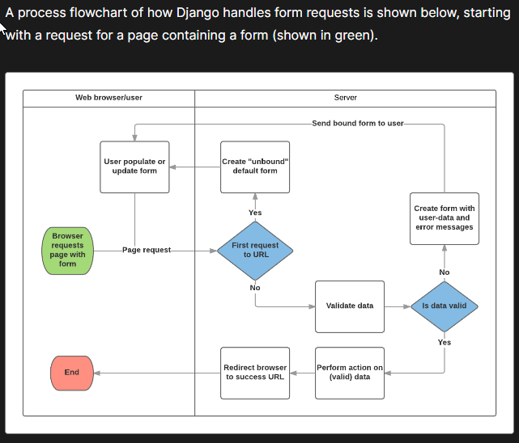
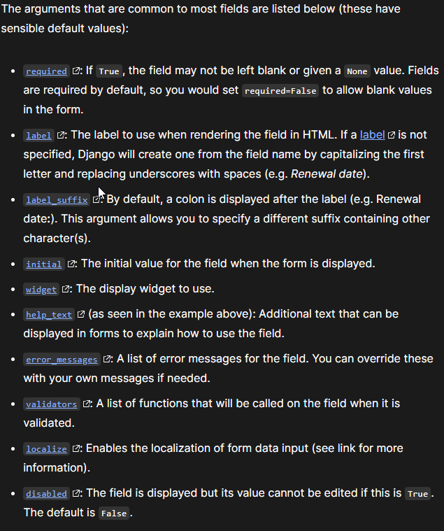

# Django CRUD

Forms add funtionality to your application, using django we will be implementing foorms and crud functionality so that a user can interact in the database functions of our django framed application

- Create
- Read
- Update
- Delete

## HTML forms

Django takes a lot of the craziness of implementing forms into your application, it provides a framework that lets you define forms and their fields programmatically, and then use these objects to both generate the form HTML code and handle much of the validation and user interaction

## Django Form Handling

Django's form handling: the view gets a request, performs any actions required including reading data from the models, then generates and returns an HTML page from a template we will pass in a context containing the data that will be displayed

the server also needs to be able to process data provided by the user, and redisplay the page if there are any errors.



main things that Django's form handling does

1. Display the default form the first time it is requested by the user.
    - The form may contain blank fields if you're creating a new record, or it may be pre-populated with initial values
    - The form is referred to as unbound at this point, because it isn't associated with any user-entered data

2. Receive data from a submit request and bind it to the form.
    - Binding data to the form means that the user-entered data and any errors are available when we need to redisplay the form.

3. Clean and validate the data.
    - Cleaning the data performs sanitization of the input fields, such as removing invalid characters that might be used to send malicious content to the server, and converts them into consistent Python types.
    - Validation checks that the values are appropriate for the field

4. If any data is invalid, re-display the form, this time with any user populated values and error messages for the problem fields.

5. If all data is valid, perform required actions (such as save the data, send an email, return the result of a search, upload a file, and so on).

6. Once all actions are complete, redirect the user to another page.

## the Form class

simplifies both generation of form HTML and data cleaning/validation

> The Form class is the heart of Django's form handling system. It specifies the fields in the form, their layout, display widgets, labels, initial values, valid values, and (once validated) the error messages associated with invalid fields. The class also provides methods for rendering itself in templates using predefined formats (tables, lists, etc.) or for getting the value of any element (enabling fine-grained manual rendering).

```python

"""
Form data is stored in an application's forms.py file, inside the application directory. Create and open the file locallibrary/catalog/forms.py. To create a Form, we import the forms library, derive from the Form class, and declare the form's fields
"""
from django import forms

class RenewBookForm(forms.Form):
    renewal_date = forms.DateField(help_text="Enter a date between now and 4 weeks (default 3).")
```

### Types of Form Fields

- BooleanField
- CharField
- ChoiceField
- TypedChoiceField
- DateField
- DateTimeField
- DecimalField
- DurationField
- EmailField
- FileField
- FilePathField
- FloatField
- ImageField
- IntegerField
- GenericIPAddressField
- MultipleChoiceField
- TypedMultipleChoiceField
- NullBooleanField
- RegexField
- SlugField
- TimeField
- URLField
- UUIDField
- ComboField
- MultiValueField
- SplitDateTimeField
- ModelMultipleChoiceField
- ModelChoiceField



## Validation Code

```python

import datetime

from django import forms

from django.core.exceptions import ValidationError
from django.utils.translation import gettext_lazy as _

class RenewBookForm(forms.Form):
    renewal_date = forms.DateField(help_text="Enter a date between now and 4 weeks (default 3).")

    def clean_renewal_date(self):
        data = self.cleaned_data['renewal_date']

        # Check if a date is not in the past.
        if data < datetime.date.today():
            raise ValidationError(_('Invalid date - renewal in past'))

        # Check if a date is in the allowed range (+4 weeks from today).
        if data > datetime.date.today() + datetime.timedelta(weeks=4):
            raise ValidationError(_('Invalid date - renewal more than 4 weeks ahead'))

        # Remember to always return the cleaned data.
        return data
```

- we get our data using self.cleaned_data['renewal_date'] and that we return this data whether or not we change it at the end of the function

- if a value falls outside our range we raise a ValidationError

## URL configuration Code

```python
urlpatterns += [
    path('book/<uuid:pk>/renew/', views.renew_book_librarian, name='renew-book-librarian'),
]

```

## other important Things to consider in forms 

View

- the view has to render the default form when it is first called and then either re-render it with error messages if the data is invalid, or process the data and redirect to a new page if the data is valid
The template

Templates


## Things I Want To Know More About


## Resources

[Django Forms](https://developer.mozilla.org/en-US/docs/Learn/Server-side/Django/Forms)

[Django Templates](https://developer.mozilla.org/en-US/docs/Learn/Server-side/Django/Home_page)

[Django Views](https://developer.mozilla.org/en-US/docs/Learn/Server-side/Django/Generic_views)
