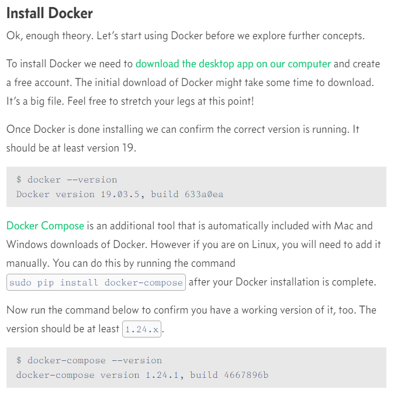

# Django Rest Framework and API's

## Docker

Docker is a way to isolate and run entire applications, it isolates the entire dev enviornment

- Docker is really just Linux containers which are a type of virtualization.

- For most applications, a virtual machine provides far more resources than are needed and a container is more than sufficient.

- Virtual environments are used to isolate Python software packages locally.

- `docker` info inspects docker

## image and containers

An image is a snapshot in time of what a project contains. A container is a running instance of the image.

## Images
- A Docker image is a pre-built and pre-configured environment for running software applications.

- It is a lightweight, stand-alone, executable package that includes everything needed to run a piece of software, including the code, a runtime, libraries, environment variables, and config files.

- Images are built from a set of instructions known as a Dockerfile, which define the base image to use, the software to install, and how to configure the environment.

- Each image is stored in a centralized repository, such as Docker Hub, and can be pulled down and run on any host with Docker installed.

- images are designed to be immutable, meaning that once built, they cannot be changed. Any updates or modifications to the software or environment must be made in a new image.

- images can be layered on top of each other, with each layer representing a change or update to the environment. This allows for efficient storage and sharing of images, as only the changes between layers need to be stored.

- images are a key component of containerization
## Containers

- A Docker container is a runnable instance of a Docker image.

- It is an isolated environment for running applications, with its own file system, network, and resources.

- Containers are created from images and can be started, stopped, moved, and deleted as needed.

- Containers share the host kernel, but have their own isolated process and network space, allowing multiple containers to run on a single host without interfering with each other.

- Containers can be created with specific resource constraints, such as memory and CPU limits, to control their resource usage.

- Containers can communicate with each other and with the host through a network, making it easy to build and run distributed applications.

- Containers can be saved and restored, allowing them to be moved between hosts or used as backups.

- Containers provide consistency and reproducibility in software deployment, as the same image can be run on any host with Docker installed, producing the same results every time.

## using API's in Django

> 1. Create a Django project and app: Start by creating a Django project and app for your API. You can use the "django-admin startproject" and "python manage.py startapp" commands to do this.

> 2. Define models: Define the models that you want to use for your API, using Django's models.py file.

> 3. Serialize data: Serialize the data from your models into a format that can be sent over the internet, such as JSON or XML, using Django's serializers.

> 4. Set up views: Set up views in Django to handle incoming HTTP requests and return the serialized data. You can use Django's generic views, such as ListAPIView and RetrieveAPIView, or create custom views to meet your needs.

> 5. Define URLs: Define URLs for your views using Django's urls.py file, mapping them to specific endpoint URLs.

> 6. Use Django REST framework: You can use the Django REST framework to simplify the process of building an API in Django. The framework provides tools for authentication, permissions, pagination, and more.

> 7. Test the API: Test the API by sending requests to the endpoint URLs and checking the responses. You can use tools such as Postman or curl to do this.

- Creating a Django project:` django-admin startproject <project_name>`

- Creating a Django app: `python manage.py startapp <app_name>`

- Migrating the database:` python manage.py migrate`

- Running the development server:` python manage.py runserver`

- Creating a superuser:` python manage.py createsuperuser`

- Installing the Django REST framework: `pip install djangorestframework`

- Installing the JSON Web Token library:` pip install djangorestframework-jwt`

- Creating a serializer:` python manage.py create_serializer <app_name> <SerializerName>`

- Making migrations:` python manage.py makemigrations`

- Running test cases: `python manage.py test`

- Running specific test cases:` python manage.py test <app_name>.tests.<TestClass>.<test_method>`

- Collecting static files:` python manage.py collectstatic`

- Dumping data to a file:` python manage.py dumpdata > <file_name>.json`

- Loading data from a file: `python manage.py loaddata <file_name>.json`

## Things I want to know more about 

If this is ging to solve all of my wsl issues

## Resources

[Beginners guide to docker](https://wsvincent.com/beginners-guide-to-docker/)

[Django for APIs - Library Website](https://djangoforapis.com/library-website-and-api/)

[Beginner’s Guide to Django REST Framework](https://wsvincent.com/official-django-rest-framework-tutorial-beginners-guide)
