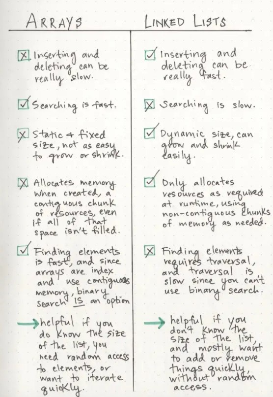

# Linked Lists

## What is a Linked list?

a linked list is a sequence of nodes that are connected to eachother, each node references the next node in the link

there is Two types of lists Singly and Doubly

1. Linked List - A data structure that contains nodes that links/points to the next node in the list.
2. Singly - Singly refers to the number of references the node has. A Singly linked list means that there is only one reference, and the reference points to the Next node in a linked list.
3. Doubly - Doubly refers to there being two (double) references within the node. A Doubly linked list means that there is a reference to both the Next and Previous node.
4. Node - Nodes are the individual items/links that live in a linked list. Each node contains the data for each link.
5. Next - Each node contains a property called Next. This property contains the reference to the next node.
6. Head - The Head is a reference of type Node to the first node in a linked list.
7. Current - The Current is a reference of type Node to the node that is currently being looked at. When traversing, you create a new Current variable at the Head to guarantee you are starting from the beginning of the linked list. 

## Traversing

When using a link list and moving through one you can not use a foeeach or a for loop the NEXT property is how you link

the best way to traverse is with a While loop this allows us to check that the next value has a value and id not null if we get null our traverals crashes

Head is always the first node in a linked list

```python
ALGORITHM Includes (value)
// INPUT <-- integer value
// OUTPUT <-- boolean

  Current <-- Head

  WHILE Current is not NULL
    IF Current.Value is equal to value
      return TRUE

    Current <-- Current.Next

  return FALSE
```

when we ude a while loop it is checking that current is pointing to a value that is not null if it returns not null anmd is equal to the value we are looking for it returns true, if not it looks further in the current if the value is not returned in the while loop through the current it will retutrn false

the big O is n because at worst its equal to the time constraint of n to the last node
for space its o of 1 because we are searching not creating more space

if we want with o(1) we need to add at the front of the list or replace the head

pseudo code for adding onto a linked list 

```python
ALGORITHM Add(newValue)
// INPUT <-- Value to add
// OUTPUT <-- No output

  newNode <-- NEW Node
  newNode.Value <-- newValue
  newNode.Next <-- Head
  Head <-- newNode
```

if you want to add a node into the middle of a list you can use the AddBefore method or you can use the AddAfter method

when inserting into the middle you have to revalue the next node for it to talk to like resetting node 

when making a node class consider requireing a value to be passed in so that each node can have a value and not return null

## what is a linkedlist anyway

linked lists are a liner data structure, in order to get to the end of the list we must pass through the beginning and the middle to reach the end.we need to go in order sequentially.

linked lists allow you to store inforamtion in differnet places they are linked but they can be wherever as long as they are tied to the road

arrays are static data structures while linked lists are dynamic staic needs an allooted amount of resources at the creation of the list you need the resources to finish the creation otherwise you have to recreate the list somwhere else where you have enough

dynamics can shrink and grow and the amount of memory they need can as well

nearly all linked lists must have a head this is the entry point to all its other elements, the end of a linked list isnt the true end its just a node that returns null

nodes contain two parts

DATA

REFERENCE TO NEXT NODE

a node only knows about what data it contains and who its neighbor is.

Singly lists go one direction doubly list will have reference to the previous node as well

a circularly linked list doesnt hav a node of null it just wraps you back to the head

## Part 2

Big O is a way of evaluating the preformance and efficiency of an algorithim

> Some external factors affect the time it takes for a function to run: the speed of the processor, what else the computer is running, etc. So it’s hard to make strong statements about the exact runtime of an algorithm. Instead we use big O notation to express how quickly its runtime grows.

O(1) constant time doesnt matter how many elements it always takes the same amount

O(n) grows equaly or lineary to the addition

Linked lists all you are doing when you add or remove is readjusting the pointers to its neighbor node

steps to insert Do in order

1. Find the node we want to change the pointer of (in this case, the last node)
2. Create the new node we want to insert and set its pointer
3. Direct the preceding node’s pointer to our new node or the new node to the head if the first node

Inserting at the end takes way more space and time because you have to travel through the whole list to get to the place you are inserting

>a linked list is usually efficient when it comes to adding and removing most elements, but can be very slow to search and find a single element.

If your list is all about adding and not about searching, linked lists are a great method


## Resources
[Big O: Analysis of algoritm effeciency](https://codefellows.github.io/common_curriculum/data_structures_and_algorithms/Code_401/class-05/resources/big_oh.html)

[Linked Lists](https://codefellows.github.io/common_curriculum/data_structures_and_algorithms/Code_401/class-05/resources/singly_linked_list.html)

[What is a linkd list](https://medium.com/basecs/whats-a-linked-list-anyway-part-1-d8b7e6508b9d)

[What is a linked list pt2](https://medium.com/basecs/whats-a-linked-list-anyway-part-2-131d96f71996)


[Differences between Arrays and Linked Lists](http://www.necessaryandsufficient.net/2008/05/differences-between-arrays-and-linked-lists/)
[Data Structures: Arrays vs Linked Lists,](https://www.youtube.com/watch?v=lC-yYCOnN8Q)

[Linked Lists: The Basics, ](https://people.engr.ncsu.edu/efg/210/s99/Notes/LinkedList.1.html)


[Introduction to Linked Lists,](https://www.cs.cmu.edu/~adamchik/15-121/lectures/Linked%20Lists/linked%20lists.html)

[Data Structures & Implementations,](http://faculty.cs.tamu.edu/welch/teaching/211.s03/lnotes1.pdf)

[Static Data Structures vs. Dynamic Data Structures](http://www.ayomaonline.com/academic/static-vs-dynamic-data-structures/)
