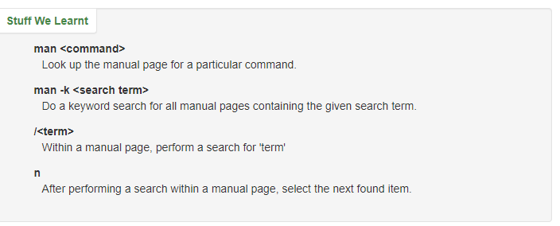
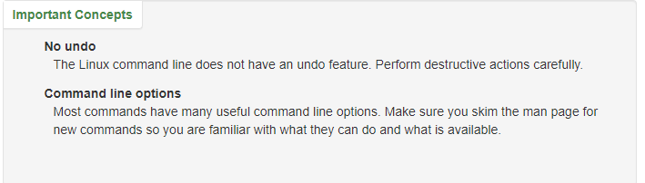

# Practicing in the Terminal

## The Command Line - What is it, how does it work and how do I get to one.

command line is the prompt in your terminal that allows you to execute actions you can get through it in utilities on different os but i have it pinned to my task bar but windows power shell or terminal are common on most machines 

## Basic Navigation - An introduction to the Linux directory system and how to get around it.

---
you can see stored input using arrows

you can also edit these with left and right arrows

pwd- print working directory or where am i?

ls-  will list what is where we currently are

you can arun command options with specific signifiers on it and it will reveal different things in the list

**Relative path**
A file or directory location relative to where we currently are in the file system.

**Absolute path**
A file or directory location in relation to the root of the file system.c

cd will take you to your home directory if it isnt given arguments or a path

tab completion can save time for you and finish the file if it is in the relative location

---

## More About Files - Find out some interesting characteristics of files and directories in a Linux environment.

everything is a file.

the .file markler indicates what kind of file the file is

Linux is case sensative

you need to be specific otherwise linux will be confused

quotes can be used to gain access to files with spaces in them or you can use an escape character like a backlash

ls -a will reveal hidden files in a list

> **file**
obtain information about what type of file a file or directory is.

> **ls -a**
List the contents of a directory, including hidden files.

---

## Manual Pages - Learn how to make the most of the Linux commands you are learning.

You can use man -k<> to search keywords and commands so that you can get further use out of your comman line

## File Manipulation - How to make, remove, rename, copy and move files and directories.

mkdir will create a directory in the location you are in

you can further supply a path with the / which shows the next step in the path

-p after mkdir will make parent directories as needed  -v tells us what mkdir is doing while its done

rmdir will remove a directory that is stated

touch creates a  blank file

cp copys a file this can also be augmented with location by path

mv will move a directory

you can use mv as well as the same location to rename a file rather than actually coppying it

rm will remove a file

rm -r will remove all children from a directory as well

## Cheat Sheet - A quick reference for the main points covered in this tutorial.

[A cheat Sheet to a lot of commands you can use in terminal](https://ryanstutorials.net/linuxtutorial/cheatsheet.php)

[Terminal information](https://ryanstutorials.net/linuxtutorial/aboutfiles.php) 