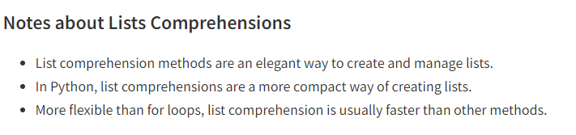

# Ten Thousand Part 3

## List Comprehensions

List comprehension is a powerful and concise method for creating lists in Python

three ingredients are necessary for a python list comprehension to work.

1. the expression we’d like to carry out. expression inside the square brackets.
2. the object that the expression will work on. item inside the square brackets.
3. an iterable list of objects to build our new list from. list inside the square brackets.

You perform an expression on each member of the list, the espression will determine waht irem is stored in the output list on the other side

you can perform expressions on an entire list in a single line of code, but its also it’s possible to add conditional statements in the form of filters



```python
# construct a basic list using range() and list comprehensions
# syntax
# [ expression for item in list ]
digits = [x for x in range(10)]

print(digits)
```

```python
[0, 1, 2, 3, 4, 5, 6, 7, 8, 9]
```

this python example by starting with the first ‘x’. This is our expression. It doesn’t do anything because we’re simply recording the number. The second ‘x’ represents each item in the list created by the range() method.

we’re using the range() method to generate a list of numbers. Python iterates(or loops) through each item in that range, and saves a copy of the item in a new list called digits.

List comprehension is a Great way to refractor in python it speeds up things becuuse you can do three things at once instead of line by line coding witht he same outcome 

## Primer and decorators

## Things i want to know more about

## Resources

This information came form

[List Comprehensions](https://www.pythonforbeginners.com/basics/list-comprehensions-in-python)
[Debugging with PySnooper](https://www.pythonpodcast.com/pysnooper-python-debugging-episode-241/)
[Primer on Decorators](https://realpython.com/primer-on-python-decorators/)