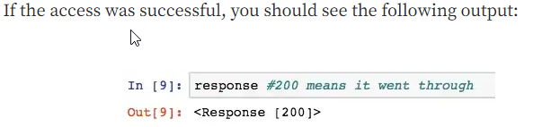
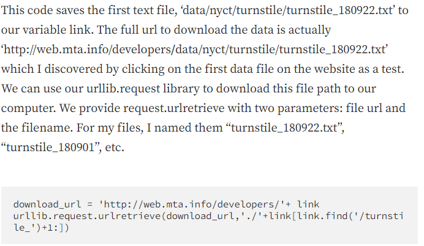

# Web Scraping 
Web Scraping is important because a lot of websites dont have an api but we want to acess data from them so when we scrape we are automating pulling things we need from a source so that we can use it in our application

## Web Scrape with python

Its important to know where you can and cannot scrape, and not to do it too fast as it could possibly lock you out or boot you from the site

the first thing you need to do is inspect the html code to see where the files are hidden

```
<a>
```
is used in a lot of situations to hold hyperlinks and .txt files

We start with some imports

```python
import requests
import urllib.request
import time
from bs4 import BeautifulSoup

url = 'http://web.mta.info/developers/turnstile.html'
response = requests.get(url)
```


now we parse it 

```python
soup = BeautifulSoup(response.text, “html.parser”)

# and use find all method to locate all of the <a> tags

soup.findAll('a')
```

then find the actual link you want to extract

```python
one_a_tag = soup.findAll(‘a’)[38]
link = one_a_tag[‘href’]
```


now add a pause in so that you dont crash the website
```python
time.sleep(1)
```

now you can use a for loop to go through and find and download all the links 

## What is Web Scraping

Web scraping is the process of automatically mining data or collecting information from the World Wide Web

## How to scrape websited without getting blocked

- Send a reasonable number of requests per second: Sending too many requests in a short amount of time can flag the website's server as a scraper, which can result in a block. Sending requests at a moderate rate can help avoid this.

- Use a rotating proxy service: A rotating proxy service allows you to use multiple IP addresses when making requests, which can help you avoid getting blocked.

- Use a user-agent rotating service: Websites can detect scraping by checking the user-agent string of the requests being sent. Using a user-agent rotating service can help you avoid detection.

- Don't scrape sensitive information or use it for illegal purposes: Scraping sensitive information such as personal information or scraping sites that prohibited scraping can get you in legal trouble and have a high change to get blocked.

- Respect website's robots.txt and terms of use : Many websites have a robots.txt file which will tell you what parts of the website are allowed to be scraped and which are not. Respect these guidelines and you will have less chance of getting blocked.

- Identify and handle captchas and anti-scraping measures: Some websites use captchas or other anti-scraping measures to detect and block scrapers. Identifying these measures and handling them appropriately can help you avoid getting blocked.

## Track Amaxon Prices

create a function to check the price onn the paramaters for the scraping using inspec on amaxons website,  you can use titles 

uset up an apss google account 

using authorization you can generate passwords

 import smtlib allows you to send emails and you can set up a server to connect your email and the gmail mailing platform
```
 Server = smtplib.SMTP()

 server.ehlo()
 sercer.startlts()
 server.ehlo

 server.login(' ')

 subject = "string to send" 

 body = "the link to check for updates"

 server.sendmail(
  'email sending from',
  'email sending to ',
  msg,
 ) 
 ```
print('hey email has been sent')

## Things I Want to Know more about

Is web scraping differnet given differnet packages and librarys used for scraping 

## Resources

[Web Scrape with Python in 4 minutes](https://towardsdatascience.com/how-to-web-scrape-with-python-in-4-minutes-bc49186a8460)

[What is Web Scraping?](https://en.wikipedia.org/wiki/Web_scraping)

[How to scrape websites without getting blocked](https://www.scrapehero.com/how-to-prevent-getting-blacklisted-while-scraping/)

[Track Amazon Prices](https://www.youtube.com/watch?v=Bg9r_yLk7VY)

[Beautuiful Soup](https://www.crummy.com/software/BeautifulSoup/)
