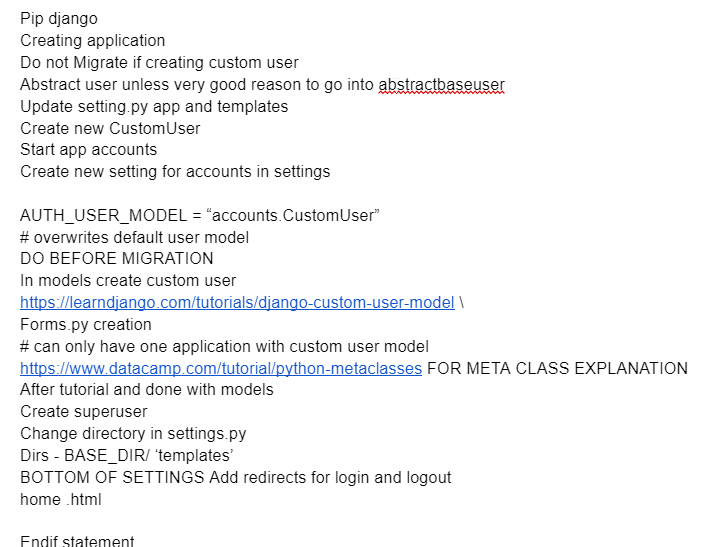

# Django Custom User Model

## Setup

1. create and navigate into a dedicated directory called accounts for our code
2. install Django
3. make a new Django project called django_project
4. make a new app accounts
5. start the local web server

Do not run migrate to configure our database yet. It's important to wait until after we've created our new custom user model before doing that

## AbstractUser vs AbstractBaseUser

AbstractBaseUser requires much, much more work

## Custom User Model

Creating our initial custom user model requires four steps:

- update django_project/settings.py
- create a new CustomUser model
- create new UserCreation and UserChangeForm
- update the admin 

in settings.py add the accounts app and use the AUTH_USER_MODEL config to tell Django to use our new custom user model in place of the built-in User model.call our custom user model CustomUser.

Within INSTALLED_APPS add accounts at the bottom. Then at the bottom of the entire file, add the AUTH_USER_MODEL config

## Things I want to know more about 

What You can really build in django, I was watching some videos and saw that spotify was built on a django framework and thats pretty cool I would love to know other things 

AbstractBaseUser

## Resources 

[Django Custum User Model](https://learndjango.com/tutorials/django-custom-user-model)

[DjangoX](https://github.com/wsvincent/djangox)

[Creating a Custom User Moel](https://www.youtube.com/watch?v=eCeRC7E8Z7Y&t=59s)

[Abstract User, User Profile and Signals in Django](https://www.youtube.com/watch?v=EudKs1HPUfE)

[Abstract User, User Profile and Signals in Django](https://www.youtube.com/watch?v=EudKs1HPUfE)

[Substituting a custom User model](https://docs.djangoproject.com/en/3.0/topics/auth/customizing/#auth-custom-user)
