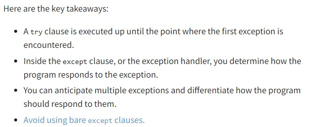

# Files and exceptions

## What is a File

a file is contiguous set of bytes used to store data, data is organized in a specific format and can be simple or incredibly complex

Files on most modern file systems are composed of three main parts:

1. Header: metadata about the contents of the file (file name, size, type, and so on)
2. Data: contents of the file as written by the creator or editor
3. End of file (EOF): special character that indicates the end of the file

what ever follows the . usually tells you what the file does or is 

## File Path

When you access a file on an operating system, a file path is required. The file path is a string that represents the location of a file. It’s broken up into three major parts:

- Folder Path: the file folder location on the file system where subsequent folders are separated by a forward slash / (Unix) or backslash \ (Windows)
- File Name: the actual name of the file
- Extension: the end of the file path pre-pended with a period (.) used to indicate the file type

## Character encoding

It’s important to note that parsing a file with the incorrect character encoding can lead to failures or misrepresentation of the character. For example, if a file was created using the UTF-8 encoding, and you try to parse it using the ASCII encoding, if there is a character that is outside of those 128 values, then an error will be thrown.

## reading a file

- .read(size=-1) This reads from the file based on the number of size bytes. If no argument is passed or None or -1 is passed, then the entire file is read.
- .readline(size=-1) This reads at most size number of characters from the line. This continues to the end of the line and then wraps back around. If no argument is passed or None or -1 is passed, then the entire line (or rest of the line) is read.
- .readlines() This reads the remaining lines from the file object and returns them as a list.
- .readlines() returns a list where each element in the list represents a line in the file:

## writing over a file

Method What It Does

- .write(string) This writes the string to the file.
- .writelines(seq) This writes the sequence to the file. No line endings are appended to each sequence item. It’s up to you to add the appropriate line ending(s).

## exceptions

A Python program terminates as soon as it encounters an error. In Python, an error can be a syntax error or an exception

exception error. This type of error occurs whenever syntactically correct Python code results in an error. The last line of the message indicated what type of exception error you ran into.

Syntax errors occur when the parser detects an incorrect statement

[types of exception errors built in to python](https://docs.python.org/3/library/exceptions.html)

We can use raise to throw an exception if a condition occurs. The statement can be complemented with a custom exception.

The AssertionError Exception
Instead of waiting for a program to crash midway, you can also start by making an assertion in Python. We assert that a certain condition is met. If this condition turns out to be True, then that is excellent! The program can continue. If the condition turns out to be False, you can have the program throw an AssertionError exception.

The try and except block in Python is used to catch and handle exceptions. Python executes code following the try statement as a “normal” part of the program. The code that follows the except statement is the program’s response to any exceptions in the preceding try clause.

when syntactically correct code runs into an error, Python will throw an exception error. This exception error will crash the program if it is unhandled. The except clause determines how your program responds to exceptions.

## Things i want to know more about

I want to know best practices and after how many repetitions this is going to be programmed into my brain, i am very lost so far and feel like i have so so much to learn to keep up with the pace but im sure there is more I can do 

## Resources

[Read & Write Files in Python](https://realpython.com/read-write-files-python/)
[Exceptions in Python](https://realpython.com/python-exceptions/)
[Read & Write Files in Python - Companion Video](https://realpython.com/courses/reading-and-writing-files-python/)