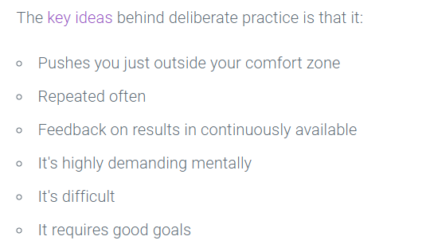

# Growth Mindset Dylan Cabral

Where To find more

[upgrade your technical skills deliberately](https://web.archive.org/web/20160616225417/http://www.happybearsoftware.com/upgrade-your-technical-skills-with-deliberate-practice)

[Carol Dweck on the Growth Mindset.](https://www.ted.com/talks/carol_dweck_the_power_of_believing_that_you_can_improve?language=en)

[Angela Lee Duckworth on Grit.](https://www.ted.com/talks/angela_lee_duckworth_grit_the_power_of_passion_and_perseverance)

[Alain de Botton on Redefining Success](https://www.ted.com/talks/alain_de_botton_a_kinder_gentler_philosophy_of_success)

## Why is Growth Mindset Important

It is important because what we do is hard, this is incredibly taxing and technical work that has the ability to affect scalable change on a macro level. practicing the same thing over and over again wont do anything but allow you to auto pilot, there is infinant things to be learned in this field and understanding that where you are now and where you are going to be are not the same or even have much of a linear connection between them, thrrough deliberate practive and avoiding the path of least resistance we can allow ourselves to grow in the way we need to. In 201 I struggled with everything other than css, 301 was java heavy, I had to grind out for growth and it revealed how rewarding and capable I really am.

>When's the last time you had to really dig deep to solve a technical problem? After a few years as a web developer, opportunities for really pushing yourself come few and far between. You can't rely on your day job to continually challenge you.

## The Keys to Deliberate Practice

## Not Yet

This is a Prime Example of this industry, we dont know how to go on or how to debug an issue, yet, we need to be challenged to grow. When you struggle there is many ways around the most rewarding is learning what is needed in order top succeed, engage with the error rather than avoiding it.
**Its Not about the grade, it is about the comprehension**

## Grit is having stamina

>grit is a marathon not a sprint, gritty individuals are more likely to succeed than others
---
>Talent doesnt make you great, trying again and again does.
---
>Failure is not a permanant situation, its a roadblock.

## Things I Want To Know More About

at the moment I dont need to know more I just want to embody that grit in this course and excel.

## Measuring Emotional intellegence

I think I am Incredibly emotionaly intellegent person, i dont know if it stems from childhood or therapy but Its been one of my most important character traits that allows me to succeed, building communities and being a good friend others as the forefront has allowed me to be successful in many ways, I measure Tone body language, am situationaly aware, and make sure to stand with those who feel underepresented or out of place hoping to help them find a home in any situation

## Measuring your Biases

I grew up all over the place from incredibly affluent places to that were ravaged by low income and lack of support, I like all have biases but i try to work on those as often as they present themselves, wheather it be in learning from people of color, those in the Queer community or Those who just have different economical or cultural backgrounds thatn myself, I think i excell in friendliness and making everyone feel welcomed by me but I understand there is many things i can not comprehend and hope that those biasis can be eroded in a culturaly diverse workplace

[Table Of Contents](../README.md)
